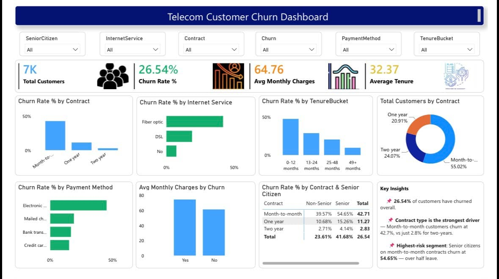

# Customer Churn Analysis

# Project Overview

This project analyzes customer churn data to identify the key factors influencing customer attrition. Using SQL, Python, and Power BI, the dataset was explored, cleaned, analyzed, and transformed into an interactive dashboard that provides actionable business insights to improve customer retention.

# Objectives

- Analyze customer churn trends.
- Identify high-risk customer segments.
- Understand factors affecting churn.
- Build an interactive Power BI dashboard.
- Provide business recommendations for customer retention.

# Tools & Technologies

- SQL
- Python
- Pandas
- NumPy
- Power BI
- Microsoft Excel

# Dashboard Preview

# Key Insights

- Customers on Month-to-Month contracts have the highest churn rate.
- Short-tenure customers are more likely to leave.
- Electronic Check payment method shows higher churn.
- Customers without Online Security or Tech Support churn more frequently.
- Contract type significantly influences customer retention.

# Business Recommendations

- Encourage customers to switch to yearly contracts.
- Offer loyalty rewards during the first year.
- Promote Online Security and Tech Support bundles.
- Improve customer experience for Electronic Check users.
- Identify high-risk customers early and provide personalized retention offers.

# Skills Demonstrated

- Data Cleaning
- SQL Querying
- Exploratory Data Analysis (EDA)
- Data Visualization
- Dashboard Development
- Business Intelligence
- Analytical Thinking

# Author

**Rohan Singh**

